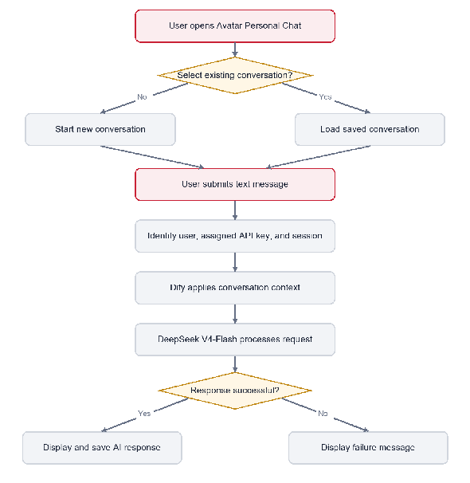

# Avatar Personal Chat — User Story (MVP)

| Field | Value |
| --- | --- |
| **Document type** | User Story |
| **Version** | 1.0.0 |
| **Status** | Draft |
| **Author** | Fahmi Jupri, IT Business Analyst |
| **Last updated** | 14 August 2026 |


This documentation is the property of Zetrix AI Berhad and contains confidential and/or proprietary information. It shall not be duplicated, used, or disclosed — in whole or in part — for any purpose other than to evaluate this document. Review of this material is considered acceptance of this notice. Content is subject to change, revision, deletion, or cessation; please confirm you are viewing the latest version.


## Revision History

| Version | Description of Revision | Author | Date |
| --- | --- | --- | --- |
| v1.0.0 | Initial draft | Fahmi | 14 August 2026 |

---

## 1. Overview

Avatar Personal Chat will provide users with a free, general-purpose AI chat experience within Zetrix Avatar. Its purpose is similar to ChatGPT and DeepSeek: users can ask questions, explore ideas, and obtain help with general tasks through a text conversation.

The MVP is intended to support user onboarding and encourage adoption of Avatar. For the first three months after launch, users will not be assigned individual usage quotas because the AI service cost is covered by Huawei.

The MVP will use DeepSeek V4-Flash as the language model. Dify will handle the AI chat workflow, conversational memory, and session management. Each user will be assigned an individual API key following the same business approach used for CelcomDigi.

The approved mock-up is the initial user-interface reference:

* Mock-up: [https://rushdantech.github.io/zetrix-avatar/personal-chat](https://rushdantech.github.io/zetrix-avatar/personal-chat)

## 2. Business Objectives

1. Deliver a simple and usable general-purpose AI chat service within Avatar.
2. Provide the service free of individual quotas during the first three months to support user onboarding.
3. Allow users to start, continue, and revisit separate AI conversations.
4. Maintain the relevant context within each conversation.
5. Observe adoption, usage, latency, concurrency, and system capacity during the MVP period.
6. Use actual MVP usage to guide later decisions on quotas, rate limits, guardrails, and Knowledge Base capabilities.

## 3. MVP Scope

### 3.1 In Scope for MVP

1. Personal Chat available to logged-in users from within the Avatar interface.
2. General-purpose text conversations with the AI.
3. Creation of a new conversation.
4. Submission of a text message and display of the AI response.
5. Multiple conversations for each user.
6. Conversation history and the ability to continue an existing conversation.
7. AI chat workflow, user memory, and session management through Dify.
8. DeepSeek V4-Flash as the agreed language model.
9. An individual API key assigned to each user following the CelcomDigi approach.
10. No individual user quota during the first three months after launch.
11. Platform-level controls where needed to manage latency, concurrency, capacity, and service stability.
12. Basic usage and performance monitoring for the three-month MVP review.
13. Front-end and back-end integration required to support the approved Avatar Personal Chat interface.

### 3.2 Later Phase


The following items are outside the MVP and may be considered after the initial launch.


1. Custom guardrails and chat-scope restrictions.
2. Knowledge Base integration.
3. Pro- and Enterprise-based quotas or rate limits.
4. Individual user quotas after the first three months.
5. OpenClaw or AvatarClaw setup-assistance workflows.

## 4. MVP Assumptions and Business Rules

### 4.1 Assumptions

1. The three-month no-quota period begins from the production launch date.
2. Huawei covers the applicable AI service cost during this period.
3. The chat will remain general purpose during the MVP and will not be restricted to an Avatar-, OpenClaw-, or AvatarClaw-specific topic.
4. The approved mock-up represents the intended MVP user experience.
5. Numerical targets for latency, concurrency, and capacity will be determined by the relevant delivery and operations teams.

### 4.2 Business Rules

| ID | Business Rule |
| --- | --- |
| BR-PC-001 | Personal Chat shall operate as a general-purpose AI chat service for the MVP. |
| BR-PC-002 | The MVP shall use DeepSeek V4-Flash. |
| BR-PC-003 | Dify shall handle the AI chat workflow, user memory, and session management. |
| BR-PC-004 | Each user shall be assigned an individual API key following the CelcomDigi approach. |
| BR-PC-005 | Users shall not be assigned an individual usage quota during the first three months after production launch. |
| BR-PC-006 | Platform-level controls may be applied to maintain service stability even though individual user quotas are not applied. |
| BR-PC-007 | Each user's key, conversations, sessions, and memory shall be kept separate from those of other users. |
| BR-PC-008 | Custom guardrails and Knowledge Base integration shall be delivered only in a later approved phase. |
| BR-PC-009 | Usage and performance during the first three months shall be reviewed before future quotas or rate limits are introduced. |
| BR-PC-010 | A user must be logged in to Avatar before accessing Personal Chat. |

## 5. User Stories

### 5.1 Access Personal Chat

`US-PC-001`

> As an Avatar user,
> I want to access Personal Chat from within Avatar,
> so that I can use a general-purpose AI assistant as part of my Avatar experience.

**Functional Requirements**

1. The system shall provide a Personal Chat entry point within the Avatar interface.
2. The system shall make Personal Chat available only to users who are logged in to Avatar.
3. The system shall display the Personal Chat workspace when a logged-in user selects the entry point.
4. The workspace shall include a conversation list, an active conversation area, and a message composer.
5. If there is no active conversation, the system shall display a new-chat state and allow the user to begin a conversation.

**Acceptance Criteria**

**Scenario: User opens Personal Chat**
- **Given** the user is logged in to Avatar
- **When** the user selects Personal Chat
- **Then** the Personal Chat workspace shall be displayed
- **And** the user shall be able to start a new conversation or select an existing conversation.

**Scenario: User is not logged in**
- **Given** the user is not logged in to Avatar
- **When** the user attempts to access Personal Chat
- **Then** the user shall not be allowed to access the Personal Chat workspace
- **And** the user shall be required to log in to Avatar.

**Scenario: No active conversation**
- **Given** the user opens Personal Chat without an active conversation
- **When** the workspace loads
- **Then** a new-chat state shall be displayed
- **And** the message composer shall be available.

### 5.2 Start a New Conversation

`US-PC-002`

> As an Avatar user,
> I want to start a separate conversation,
> so that I can discuss a new question or task without mixing it with another conversation.

**Functional Requirements**

1. The system shall provide a New Chat action.
2. Selecting New Chat shall prepare a separate conversation for the user.
3. A new conversation shall initially display an empty state until the user submits a message.
4. The new conversation shall be associated with the correct user and session.
5. Messages from another conversation shall not appear in the new conversation.

**Acceptance Criteria**

**Scenario: User starts a new conversation**
- **Given** the user is viewing Personal Chat
- **When** the user selects New Chat
- **Then** the system shall present a separate empty conversation
- **And** the user shall be able to enter a message
- **And** messages from a previously selected conversation shall not appear.

### 5.3 Send a Message and Receive an AI Response

`US-PC-003`

> As an Avatar user,
> I want to submit a text message and receive an AI response,
> so that I can ask questions, explore ideas, or obtain help with general tasks.

**Functional Requirements**

1. The system shall provide a text composer within the active conversation.
2. The system shall allow the user to submit a non-empty text message.
3. The system shall display the submitted message in the active conversation.
4. The message shall be processed using the agreed MVP AI chat service.
5. The system shall display the AI response in the same conversation.
6. User and AI messages shall be visually distinguishable.
7. Messages shall be displayed in chronological order.
8. The system shall not submit an empty message.
9. If the AI service cannot complete a response, the system shall display an understandable failure message without removing the existing conversation history.

**Acceptance Criteria**

**Scenario: Successful response**
- **Given** the user is in an active conversation
- **And** the user has entered a non-empty message
- **When** the user submits the message
- **Then** the user's message shall appear in the conversation
- **And** the message shall be processed by the agreed AI chat service
- **And** the AI response shall appear in the same conversation.

**Scenario: Empty message**
- **Given** the message composer is empty
- **When** the user attempts to submit the message
- **Then** the system shall not create or send a chat message.

**Scenario: Response is unsuccessful**
- **Given** the user has submitted a valid message
- **When** the AI service cannot complete the response
- **Then** the system shall display an understandable failure message
- **And** the existing conversation history shall remain available.

### 5.4 Maintain Conversation Context

`US-PC-004`

> As an Avatar user,
> I want the AI to retain the context of my active conversation,
> so that I can ask follow-up questions without repeating the full discussion.

**Functional Requirements**

1. The system shall maintain a separate session for each conversation.
2. Dify shall manage user memory and session management for the AI chat.
3. A follow-up message shall use the relevant previous context from the same conversation.
4. One user's conversation context shall not be available to another user.
5. Detailed memory duration and any memory behaviour across separate conversations are not defined by the email conclusion and shall be determined as part of the Dify workflow design.

**Acceptance Criteria**

**Scenario: Follow-up message uses conversation context**
- **Given** the user has exchanged messages with the AI in an active conversation
- **When** the user submits a follow-up message referring to the earlier exchange
- **Then** the message shall be processed using the relevant context from that conversation.

### 5.5 View and Continue Previous Conversations

`US-PC-005`

> As an Avatar user,
> I want to view and reopen my previous conversations,
> so that I can continue an earlier discussion.

**Functional Requirements**

1. The system shall display the user's conversations in a conversation list.
2. Each conversation shall show a title, recent-message preview, and activity time, consistent with the approved mock-up.
3. The system shall visually identify the selected conversation.
4. Selecting a conversation shall display its saved message history.
5. The user shall be able to submit a new message after reopening a conversation.
6. Only conversations belonging to the current user shall be displayed.

**Acceptance Criteria**

**Scenario: User views conversation history**
- **Given** the user has previous conversations
- **When** the user opens Personal Chat
- **Then** the user's conversation list shall be displayed
- **And** each conversation shall show its identifying summary information.

**Scenario: User continues a conversation**
- **Given** the user has a previous conversation
- **When** the user selects that conversation
- **Then** its saved messages shall be displayed in the correct order
- **And** the user shall be able to submit a follow-up message.

**Scenario: User conversation ownership**
- **Given** the user opens the conversation list
- **When** conversation history is displayed
- **Then** only conversations belonging to that user shall be shown.

### 5.6 Assign an Individual API Key

`US-PC-006`

> As the Avatar service owner,
> I want each user to have an individually assigned API key,
> so that access follows the same business approach used for CelcomDigi.

**Functional Requirements**

1. The system shall associate each logged-in Avatar user with an individual API key.
2. The key shall be associated with the correct Avatar user.
3. The system shall use the correct assigned key when processing the user's chat requests.
4. The API key shall not be displayed in the Personal Chat interface.
5. One user's key shall not be exposed to or used as another user's identity.

**Acceptance Criteria**

**Scenario: Correct key is used for the user**
- **Given** an Avatar user has an assigned API key
- **When** the user submits a chat message
- **Then** the request shall be associated with that user's key
- **And** the key value shall not be visible in the Personal Chat interface.

**Scenario: User information remains separate**
- **Given** two users have separate assigned keys and conversations
- **When** either user accesses Personal Chat
- **Then** that user shall not see the other user's key, conversations, sessions, or memory.

### 5.7 Provide No-Quota Access During the MVP Period

`US-PC-007`

> As an Avatar user,
> I want to use Personal Chat without an individual quota during the introductory period,
> so that I can explore the service freely.

**Functional Requirements**

1. The system shall not enforce an individual user quota during the first three months after production launch.
2. Pro- or Enterprise-based quotas shall not be introduced during the MVP unless separately approved.
3. Platform-level controls may be applied to manage latency, concurrency, capacity, availability, or upstream service limits.
4. If a platform-level condition temporarily prevents a request, the user shall receive an understandable service-status message.

**Acceptance Criteria**

**Scenario: No individual quota during the MVP period**
- **Given** the service is within the first three months after production launch
- **When** a logged-in Avatar user uses Personal Chat
- **Then** the request shall not be rejected because the user has reached an individual usage quota.

**Scenario: Platform capacity is temporarily limited**
- **Given** service demand reaches a platform protection condition
- **When** the user's request cannot be processed
- **Then** the system shall display an understandable temporary service message
- **And** the message shall not state that the user's individual quota has been exhausted.

### 5.8 Monitor MVP Usage and Performance

`US-PC-008`

> As the Avatar product team,
> I want to review basic adoption, usage, and performance information,
> so that later product and capacity decisions are based on actual MVP usage.

**Functional Requirements**

1. The service shall record basic usage and performance information for the first three months. The information shall support review of:
   * Number of users using Personal Chat.
   * Number of conversations created.
   * Number of chat requests.
   * Successful and unsuccessful requests.
   * Response latency.
   * Concurrent usage or peak demand, where measurable.
2. Usage and performance information shall be available only to authorised personnel.

**Acceptance Criteria**

**Scenario: Product team reviews MVP usage**
- **Given** users have used Personal Chat
- **When** authorised personnel review the MVP period
- **Then** they shall be able to review adoption, chat volume, request success or failure, response latency, and capacity trends.

## 6. MVP Non-Functional Requirements

| ID | Category | Requirement |
| --- | --- | --- |
| NFR-PC-001 | Performance | Chat response latency shall be monitored during the MVP period. |
| NFR-PC-002 | Scalability | The service shall support user-onboarding growth, subject to platform-level capacity controls. |
| NFR-PC-003 | Security | User API keys, identities, sessions, memory, and conversations shall be protected from unauthorised access. |
| NFR-PC-004 | User isolation | One user's key, conversations, sessions, and memory shall not be exposed to another user. |
| NFR-PC-005 | Usability | The MVP shall follow the approved mock-up and provide clear new-chat, conversation, message, empty, and failure states. |
| NFR-PC-006 | Extensibility | The solution shall allow later addition of guardrails, Knowledge Base integration, and plan-based quotas without significant rework. |

## 7. High-Level MVP Flow

*Figure 1. High-level Avatar Personal Chat MVP flow — user opens Personal Chat, starts or loads a conversation, submits a message, Dify applies context, DeepSeek V4-Flash processes the request, and the system displays either the AI response or a failure message.*

## 8. UI/UX Reference

* Approved mock-up: [https://rushdantech.github.io/zetrix-avatar/personal-chat](https://rushdantech.github.io/zetrix-avatar/personal-chat)

## 9. MVP Business Acceptance

The MVP may be considered ready for business acceptance when:

- [ ] Logged-in Avatar users can access Personal Chat.
- [ ] Users can start a new conversation.
- [ ] Users can submit a text message and receive an AI response.
- [ ] Users can view and continue their own previous conversations.
- [ ] The AI retains relevant context within the active conversation.
- [ ] Dify manages the AI workflow, conversation memory, and sessions.
- [ ] DeepSeek V4-Flash is used as the agreed MVP language model.
- [ ] Each user is associated with an individual API key using the approved CelcomDigi approach.
- [ ] No individual user quota is enforced during the confirmed first three months.
- [ ] Platform-level controls and clear failure messages support service stability.
- [ ] User keys, conversations, sessions, and memory are kept separate from other users.
- [ ] Basic adoption, usage, latency, failure, and concurrency information can be reviewed by authorised personnel.
- [ ] The implemented interface is aligned with the approved mock-up.

## 10. Appendices

### 10.1 Appendix A — Glossary

| Term | Meaning in this document |
| --- | --- |
| AI chat | A text conversation in which a user submits a message and receives an AI-generated response. |
| API key | A credential assigned for access to the AI service. The MVP requires an individual key for each user. |
| Avatar | The Zetrix Avatar platform in which Personal Chat will be provided. |
| Dify | The agreed platform for the AI workflow, conversation memory, and session management. |
| Guardrail | A control that constrains or governs AI inputs or outputs. Custom guardrails are planned for a later phase. |
| Knowledge Base | A managed information source used to ground AI responses. Knowledge Base integration is planned for a later phase. |
| MVP | The minimum set of capabilities required to launch and validate Avatar Personal Chat. |
| Platform-level control | A service-wide control used to protect capacity or stability; it is different from an individual user quota. |
| Session | The conversation-specific state used to maintain context across messages. |
| User quota | An individual usage allowance. No individual quota will apply during the first three months after MVP launch. |

### 10.2 Appendix B — Email Conclusion Traceability

| Agreed Email Conclusion | Requirement Coverage |
| --- | --- |
| The Phase 1 objective is to provide a free AI chat experience to onboard users and encourage adoption. | Sections 1, 2 |
| A user must log in to Avatar before using Personal Chat. | Section 3.1; BR-PC-010; US-PC-001; Acceptance item 1 |
| No individual user quota will be assigned during the first three months because the AI cost is covered by Huawei. | Sections 1, 3.1; BR-PC-005; US-PC-007 |
| Latency, concurrency, system capacity, and platform-level rate limiting must be considered. | Sections 2, 3.1; BR-PC-006; US-PC-007; NFR-PC-001, NFR-PC-002 |
| The AI chat will be a general-purpose service similar to ChatGPT and DeepSeek. | Sections 1, 3.1; BR-PC-001; US-PC-003 |
| The model will be DeepSeek V4-Flash. | Section 1; BR-PC-002; Acceptance item 7 |
| Each user will be assigned an individual API key following the CelcomDigi method. | Section 3.1; BR-PC-004; US-PC-006 |
| Dify will handle the AI workflow, user memory, and session management. | Section 1; BR-PC-003; US-PC-004 |
| Guardrails and Knowledge Base capabilities will be introduced later. | Section 3.2; BR-PC-008; NFR-PC-006 |
| The initial architecture should allow guardrails and Knowledge Base controls to be added without significant rework. | NFR-PC-006 |
| The team must align the architecture, user/session identification, API-key assignment, capacity controls, and back-end/front-end integration. | Section 10 |
| The Personal Chat mock-up was accepted as looking good. | Sections 1, 8; US-PC-001, US-PC-005 |
| The first three months will be used to gather usage data and refine later controls. | Section 2; BR-PC-009; US-PC-008 |

---

*© Zetrix AI Berhad, Petaling Jaya, 2026. Company No. 505639-K. All rights reserved.*
